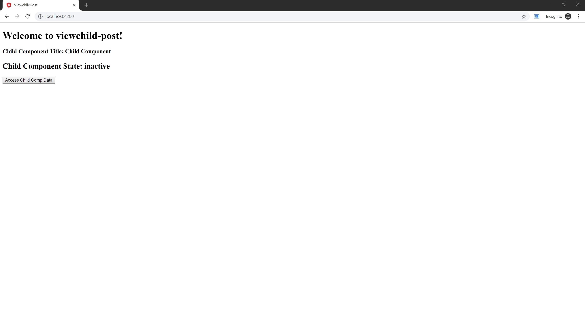

# Replace @OutPut, @Input, and EventEmitters with ViewChild For Component Interaction

The first time I used the Angular framework I found the concept of two-way data binding hard to grasp. A simple app I would build quickly grew complex with the more properties I needed to share between child and parent components. The straight forward solution was to use data binding with @Input, @Output, and EventEmitters.

There are better ways, however. Using ViewChild is one, and Services is another. In this tutorial, I'll show you how to use ViewChild as an effective way of passing props and accessing content in a child component from a parent component.

## What You'll Learn

- Why Use ViewChild?
- What Is ViewChild?
- How Is ViewChild Structured?
- Referencing With ViewChild
- How To Use ViewChild
- Conclusion

## Why Use ViewChild?

ViewChild allows a parent component to access a child component's content. This is handy when we want to call a child component's function or reference its properties.

## What Is ViewChild?

ViewChild is a property decorator. It is a class or a class member (an attribute or a method) that configures (decorates) a view query.

## How Is ViewChild Structured?

To use the ViewChild one must understand ViewChild. Here is a code snippet to help us break down the decorator's basic structure.

```typescript
@Component({
  selector: 'app-modal',
  template: `
    <div #elementToMatch></div>
  `
})
export class MyCompComponent {
  @ViewChild('elementToMatch', { static: false }) elementToMatch: ElementRef;
}
```

As we can see the ViewChild decorator accepts three parameters:

- selector
  - first parameter that matches the first component, directive, or element in the view query as a reference.
- static
  - a boolean that tells angular if the query should be ran statically or dynamically which changes when the view query will resolve.
- read
  - an optional param that allows changing of the type of view query result.

We use these parameters as a way of referencing an element in the DOM, or a component or directive.

## Referencing With ViewChild

There are a few ways of referencing a selector: template, reference of component or directive decorators, or a templateRef.

In the previous code sample we added `#elementToMatch` to the `div` tag. This is how we reference the element we're interested in.

## How To Use ViewChild

We understand why to use ViewChild and how it's structured. Let's begin to understand how ViewChild works by building a simple app.

Our app will demonstrate the following:

- Calling a child component's method from the parent
- Grabbing the child component's properties
- Passing a value to the child component from the parent component

## Step 1: edit the app component
Assuming you've started a basic Angular app using Angular's CLI we'll first edit the `app.component.ts` file.

Add a method `changeChildCompState()`, and a property `childCompTitle` with the string `n/a`. Our method will replace this string with another string titled 'click' when the method is called.

the file should look like this:

```typescript
  childCompTitle = 'n/a';

  changeChildCompState() {
    this.childCompTitle = 'clicked'
  }
```

Go to the `app.component.html` and edit it like so. we are interpolating the `buttonState` string and calling our `changeChildCompState()` function once a user clicks the button 'Change component state'.

```typescript
<h1>Welcome to {{ title }}!</h1>
<h2>{{ buttonState }}</h2>
<button (click)="changeChildCompState()">Access Child Comp Data</button>
```

Now if we navigate to the app. we will see our button and the interpolated texts. When we click the button our string should go from n/a to clicked.


## Step 2: Generate A Child Component

Using the Angular CLI run `ng generate component child` to create a component named 'child'.
This will be the child component that is triggered from the button we added in `app.component.ts`.

Add the component to `app.component.html` like so:

```typescript
<app-child></app-child>
```

Once added you should see proof that the component has been added.


## Step 3: Update The Child Component

In the file `child.component.ts` add the method `changeCompState()` and the properties `compState` and `compTitle`.

We will later use a `ViewChild` decorator from the parent component to call the method `changeCompState()` which accepts a parameter `newState`. This parameter will have the string value of 'active'. `newState` will then change the `compState` property from 'inactive' to 'active'.

Our file `child.component.ts` should look like this:

```typescript
import { Component, OnInit } from '@angular/core';

@Component({
  selector: 'app-child',
  templateUrl: './child.component.html',
  styleUrls: ['./child.component.css']
})
export class ChildComponent implements OnInit {


  compState = "inactive";
  compTitle = "Child Component";
  newState: string;

  constructor() { }

  ngOnInit() {
  }

  changeCompState(newState) {
    this.compState = newState;

  }

}
```

Next update the child template with some interpolation like so
```typescript
<h1>{{title}}</h1>
<h2>Child Component State: {{compState}}</h2>
```

## Step 4: Update App Component With ViewChild Functionality

Let's start by adding a reference, `#childRef` to the child component's tag in the app template like so:

```typescript
<app-modal #childRef></app-modal>
```

Now we'll go to `app.component.ts` and import `ViewChild`, `AfterViewInit`, and `ElementRef` from `@angular/core`;

```typescript
import { Component, ViewChild, AfterViewInit, ElementRef } from '@angular/core';
```

Next we'll add a ViewChild property named `childElementRef` and target the reference we added to the app-modal tag `childRef`.

```typescript
  @ViewChild('childRef') childElementRef: ElementRef;

```

We are now able to access the referenced 'childRef' element but only after the parent component is rendered by using the Lifecycle hook `ngAfterViewInit`. To do so first implement `AfterViewInit` to the class.

```typescript
export class AppComponent implements AfterViewInit {}
```

Now we can create the method `ngAFterViewInit`. inside the method we'll access the referenced component like so

```typescript

  ngAfterViewInit(): void {}
```

The child component's content is now accessible we'll use dot notation to first replace the string property `childCompTitle` with the child component's title stored in it's own string property `compTitle`.

```typescript

  ngAfterViewInit(): void {
    this.childCompTitle = this.childElementRef.compTitle;
  }
```

We'll also invoke the child component's method `changeCompState()`.
To do so wrap the referenced method call inside the parent component's method `changeChildCompState()`.

```typescript
  changeChildCompState() {
    this.childElementRef.changeCompState()
  }
  ```

Clicking the button will change the text in the child component `inactive` to `active`.



## Conclusion

What we just learned is an easier way of handling child component data by using ViewChild to grab data from a child component, call a child component's function, and pass a prop from a parent component to a child component. We completely bypassed EventEmitters, outputs, and inputs which could get messy and confusing quickly.

Take a look at the app below

https://stackblitz.com/edit/angular-viewchild-post

## references
- [share component data with other components](https://levelup.gitconnected.com/angular-7-share-component-data-with-other-components-1b91d6f0b93f)
- [Angular ViewChild](https://angular.io/api/core/ViewChild)
- [Angular ViewChild In Depth Explanation](https://blog.angular-university.io/angular-viewchild/)
- [component interaction](https://angular.io/guide/component-interaction)
